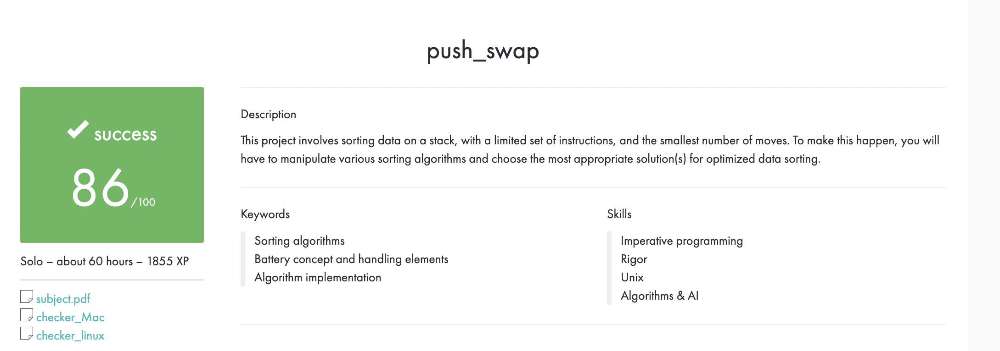

# 42-push_swap

## *This is my old version of the project, made on arrays*

# Subject
**The assignment is here!** [(link)](https://github.com/AtaullinShamil/42-push_swap/blob/main/includes/push_swap_subject.pdf)